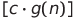
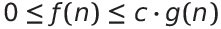
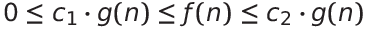
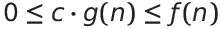

# Data structures and Algorithms
**C++**, **python**  
C로 포인터, 자료구조 마스터

Greedy -> Search(Brute-force, BFS, DFS) -> DP -> Graph -> String  
삼성역량테스트 B형, cordforce blue level 정도가 하한선

코드업 100제(C++), Algoexpert+인프런C++

[Sort Animations](https://www.toptal.com/developers/sorting-algorithms)
## Aysmtotic Notation
n은 충분히 크다고 가정 (n이 작은 경우 뭘써도 빠름)  
f값은 소요시간
### Big O (Upper bound)
주어진 알고리즘이 아무리 나빠도 비교하는 함수와 같거나 좋다.  
c는 임의의 양수  
**O(g(n))**  

### Big  (Tight bound)
주어진 알고리즘이 아무리 좋거나 나뻐도 비교하는 함수의 범위안에 있다.  

### Big  (Lower bound)
주어진 알고리즘이 아무리 좋아도 비교하는 함수와 같거나 나쁘다.  

### Time Complexity
인풋 크기에 비례하는 알고리즘의 실행 시간
### Space Complexity
인풋 크기에 비례하는 알고리즘이 사용하는 메모리 공간

