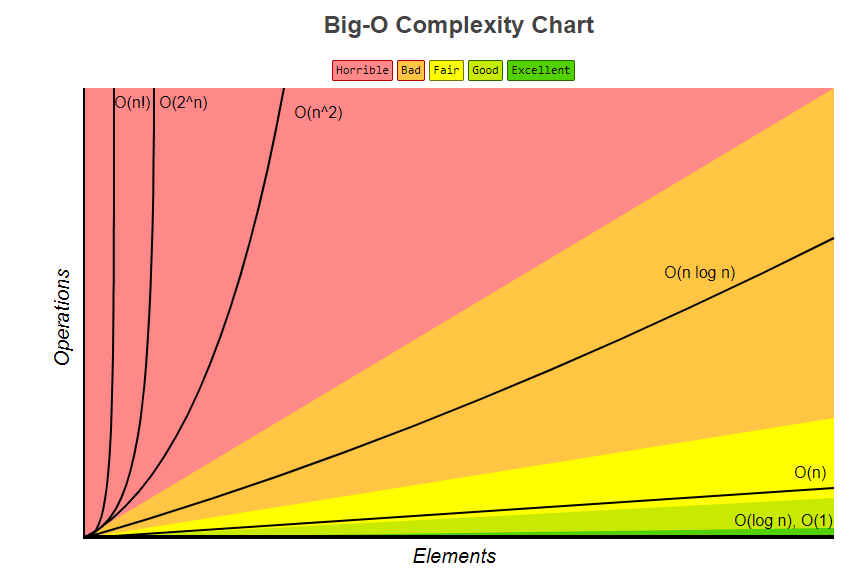
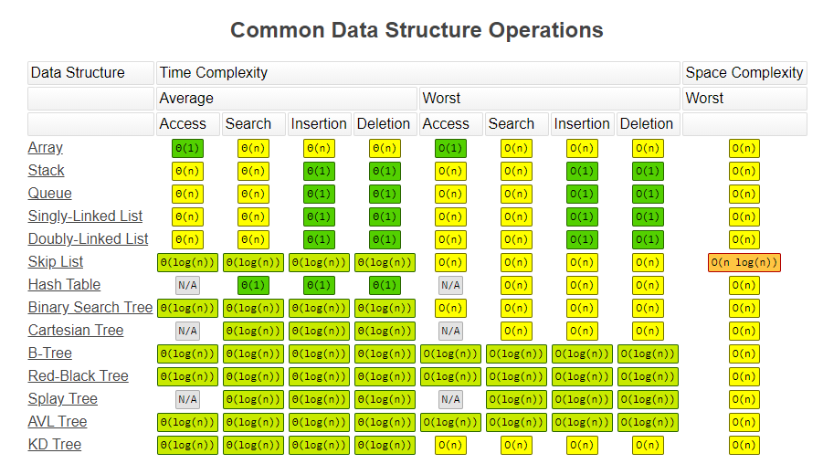
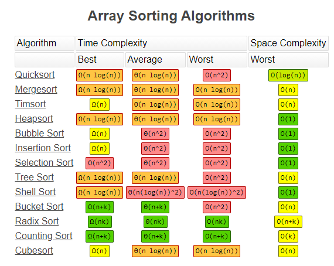

# Data structures and Algorithms
**C++**, **python**  
Greedy -> Search(Brute-force, BFS, DFS) -> DP -> Graph -> String  
삼성역량테스트 B형, cordforce blue level 정도가 하한선
- [Algorithms](#algorithms)
  - [Aysmtotic Notation](#aysmtotic-notation)
    - [Big O (Upper bound)](#big-o-upper-bound)
    - [Big !theta (Tight bound)](#big--tight-bound)
    - [Big !omega (Lower bound)](#big--lower-bound)
  - [Evaluation](#evaluation)
    - [Time Complexity](#time-complexity)
    - [Space Complexity](#space-complexity)
  - [Greedy Algorithm](#greedy-algorithm)
  - [Search](#search)
    - [Brute Force](#brute-force)
    - [Linear search](#linear-search)
    - [Binary search](#binary-search)
  - [Divide and Conquer](#divide-and-conquer)
  - [Dynamic Programming](#dynamic-programming)
  - [Graphs](#graphs)
    - [Minimum Spanning Tree](#minimum-spanning-tree)
    - [Dijkstra's Algorithm](#dijkstras-algorithm)



  

[Sort Animations](https://www.toptal.com/developers/sorting-algorithms)
# Algorithms
## Aysmtotic Notation
n은 충분히 크다고 가정 (n이 작은 경우 뭘써도 빠름)  
f값은 소요시간
### Big O (Upper bound)
주어진 알고리즘이 아무리 나빠도 비교하는 함수와 같거나 좋다.  
c는 임의의 양수  
**O(g(n))**  

### Big  (Tight bound)
주어진 알고리즘이 아무리 좋거나 나뻐도 비교하는 함수의 범위안에 있다.  

### Big  (Lower bound)
주어진 알고리즘이 아무리 좋아도 비교하는 함수와 같거나 나쁘다.  

## Evaluation
### Time Complexity
인풋 크기에 비례하는 알고리즘의 실행 시간
```python
# O(1), 입력 값의 크기가 함수 실행시간에 영향 x
def print_first(my_list):
    print(my_list[0])

# O(lg n)
def print_powers_of_two(n):
    i = 1
    while i < n:
        print(i)
        i = i * 2

# O(n), 약 3n의 실행시간이지만 O(n)로 표기됨
def print_three_times(my_list):
    for i in range(len(my_list)):
        print(my_list[i])

    for i in range(len(my_list)):
        print(my_list[i])

    for i in range(len(my_list)):
        print(my_list[i])

# O(n*lg n)
def print_powers_of_two_repeatedly(n):
    for i in range(n): # 반복횟수: n에 비례
        j = 1
        while j < n: # 반복횟수: lg n에 비례
            print(i, j)
            j = j * 2

# O(n^2)
def print_pairs(my_list):
    for i in range(len(my_list)):
        for j in range(len(my_list)):
            print(my_list[i], my_list[j])

# O(n^3)
def print_triplets(my_list):
    for i in range(len(my_list)):
        for j in range(len(my_list)):
            for k in range(len(my_list)):
                print(my_list[i], my_list[j], my_list[k])
```
### Space Complexity
인풋 크기에 비례하는 알고리즘이 사용하는 메모리 공간
```python
# O(1), 입력값 개수에 상관없이 result 값은 1개
def product(a, b, c):
    result = a * b * c
    return result

# O(n)
def get_every_other(my_list):
    every_other = my_list[::2]
    return every_other

# O(n^2), products는 리스트 모든 내부 값들의 조합 곱 
def largest_product(my_list):
    products = []
    for a in my_list:
        for b in my_list:
            products.append(a * b)
    
    return max(products)
```
## Greedy Algorithm
## Search
### Brute Force
### Linear search
### Binary search
sorted list에서만 사용 가능

## Divide and Conquer
Top-down 해결방식  
큰 문제를 해결하기 위해 충분히 작아질 때까지 문제를 쪼개고 해결한 작은 문제를 가지고 바로 윗 단계의 문제를 해결하는 방식  
문제를 쪼갤 때 부분 문제는 중복되지 않음 (DP와 달리 재활용 불가)  
일반적으로 recursion으로 구현  

## Dynamic Programming
Bottom-up 해결방식  
큰 문제를 작은 문제들로 나누어 부분적으로 해결한 후 여기서 파생된 값을 이용하여 전체 문제를 해결  
문제를 쪼갤 때 부분 문제는 중복되어 **재활용**
## Graphs
A set of Vertices and a sef of Edges(connects two vertices)
### Minimum Spanning Tree
### Dijkstra's Algorithm

